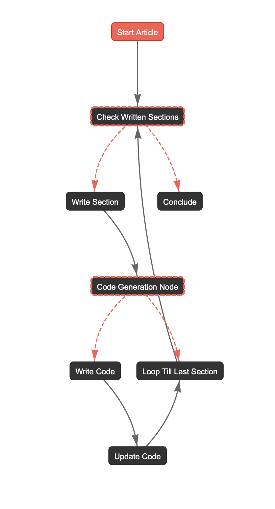
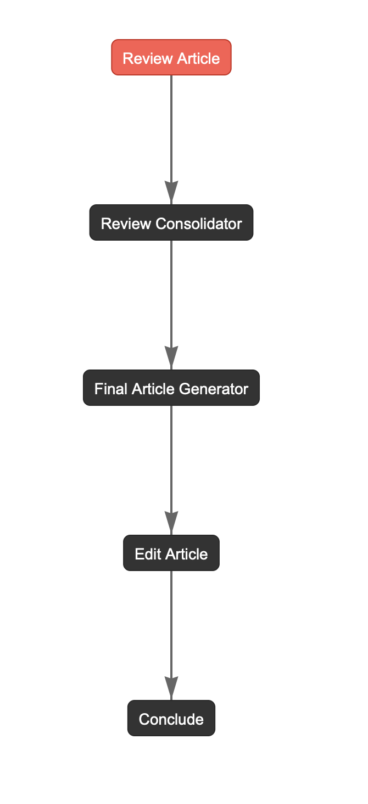

# BlogWriter

BlogWriter è un framework modulare basato su [CrewAI](https://github.com/joaomdmoura/crewai) pensato per trasformare titolo, abstract e scaletta in articoli tecnici completi. La libreria orchestra squadre di agenti per validazione, scrittura, generazione di codice e revisione editoriale, esponendo sia flow asincroni sia una CLI end-to-end.

## Caratteristiche principali
- **Pipeline completa**: esecuzione in sequenza dei flow di validazione, scrittura ed editing con stato condiviso (`ArticleState`).
- **Agenti configurabili da YAML**: agenti, task e tool sono caricati dinamicamente tramite `utils.config_loader`, con registry LLM preconfigurato per modelli Ollama.
- **Scrittura contestuale**: ogni sezione viene generata insieme al relativo riassunto e alle istruzioni opzionali per il codice, mantenendo coerenza lungo tutto l'articolo.
- **Generazione e revisione del codice**: quando il writer inserisce il marker `[CODICE_RICHIESTO][START] … [END]`, partono automaticamente le crew di sviluppo e code review.
- **Editing multi-review**: l'`EditingFlow` esegue più passaggi di supervisione, consolida i feedback e applica le revisioni prima di produrre il Markdown finale.
- **Logging con metriche**: il logger `NonRepetitiveLogger` salva log deduplicati (anche su file rotanti) e `summarize_log_metrics` produce statistiche utili al termine di ogni flow.

## Architettura della repository
```
blogwriter/
├── crews/                # Definizioni di agenti, task e flow (input_validator, writing, editing)
├── dashboards/           # Bozze di dashboard Streamlit per audit e revisione
├── llm/                  # Wrapper per modelli Ollama usati dagli agenti
├── notebooks/            # Notebook di validazione end-to-end
├── orchestrator/         # Orchestratore asincrono e CLI
├── schema/               # Modelli Pydantic dello stato condiviso
├── utils/                # Loader YAML, logger avanzato, utility Markdown e riassunti
├── Makefile              # Shortcut per lint/test (da completare)
├── pyproject.toml        # Gestione dipendenze tramite Poetry
└── README.md
```

## Requisiti
- Python 3.10 – 3.12
- [Poetry](https://python-poetry.org/) per la gestione delle dipendenze
- Server [Ollama](https://ollama.com/) raggiungibile (default `http://localhost:11434`) con i modelli referenziati (`ollama/gpt-oss:20b`, `ollama/deepseek-coder:33b`, `ollama/gemma3:27b`, `ollama/phi4`).

Installazione delle dipendenze:

```bash
poetry install
```

## Configurazione degli LLM
Il registry di default è definito sia nell'orchestratore (`orchestrator.orchestrator.build_default_agent_registry`) sia in `utils.config_loader.DEFAULT_AGENT_REGISTRY`. Puoi:

1. Sovrascrivere i parametri dei modelli passando un `agent_registry` personalizzato alle crew o alla funzione `blogwriter_orchestrator`.
2. Aggiungere nuovi tool implementando classi in `blogwriter.tools.*` e richiamandole dagli YAML degli agenti.

## Flows Architecture
### 1. InputValidatorFlow
- Verifica che il titolo sia valorizzato, generando input interattivo se manca.
- Produce o migliora l'abstract tramite l'agente `abstract_writer`.
- Analizza la struttura proposta con l'agente `project_manager`, usando un parser sicuro (`safe_literal_list_parse`).
- Genera un riepilogo delle metriche di log nel campo `log_summary`.


### 2. WritingArticleFlow
- Cicla sulle sezioni dello stato condiviso generando paragrafi coerenti e riassunti sintetici (`utils.context_summarizer_crew.summarize_section`).
- Estrae eventuali richieste di codice dal testo e invoca automaticamente gli agenti `code_writer` e `code_reviewer`.
- Aggiorna mappe di paragrafi, riassunti, istruzioni e snippet all'interno dell'`ArticleState`.



### 3. EditingFlow
- Crea il Markdown originale e avvia una supervisione iterativa (`num_reviews`) con l'agente `supervisor`.
- Consolida i feedback multipli con `review_consolidator` e applica le modifiche via `editor_profile`.
- Rigenera il Markdown finale tramite `utils.markdown_utils.MarkdownUtils`, opzionalmente salvandolo su file.
- Calcola statistiche sui log a fine processo.



## Orchestrazione end-to-end
L'orchestratore asincrono collega i tre flow in sequenza, gestendo diagrammi dei flow (`orchestrator/flow_chart/`) e la scrittura opzionale del Markdown.

Esecuzione da CLI:

```bash
poetry run python -m orchestrator.orchestrator \
    --title "Titolo" \
    --abstract "Abstract opzionale" \
    --structure Introduzione "Metodologia & Dati" Conclusioni \
    --num_reviews 5 \
    --write_output \
    --markdown_outpath ./outputs/articolo.md \
    --log_level DEBUG
```

Flag utili:
- `--num_reviews`: numero di cicli di supervisione (>=1, default 10).
- `--write_output`: salva il Markdown finale (default disattivato).
- `--markdown_outpath`: percorso personalizzato del file Markdown.
- `--no_plot_flows`: disabilita l'esportazione dei diagrammi Graphviz.
- `--log_level`: livello di logging (DEBUG/INFO/WARNING/ERROR).

In alternativa puoi richiamare `blogwriter_orchestrator` dal tuo codice Python per integrare BlogWriter in pipeline personalizzate.

## Notebook di verifica
`notebooks/check_components.ipynb` mostra come instanziare le crew, disabilitare la telemetria di CrewAI e verificare l'intera pipeline in modalità asincrona.

## Logging e metriche
I log sono gestiti da `utils.logger`:
- `get_logger` crea logger con RichHandler su console e RotatingFileHandler in `logs/` (creata automaticamente).
- `summarize_log_metrics` fornisce statistiche (conteggio livelli, durata, messaggi più frequenti, transizioni) salvate nello stato finale dei flow.

## Dashboard sperimentali
La cartella `dashboards/` contiene `streamlit_editor.py` pensate per ispezionare e revisionare il documento. 

## Contributi
1. Effettua il fork e crea un branch dedicato.
2. Installa le dipendenze con Poetry.
3. Aggiorna agenti/task modificando i rispettivi file YAML e, se serve, il registry LLM.
4. Apri una Pull Request descrivendo modifiche, impatto sui flow e requisiti per l'esecuzione.